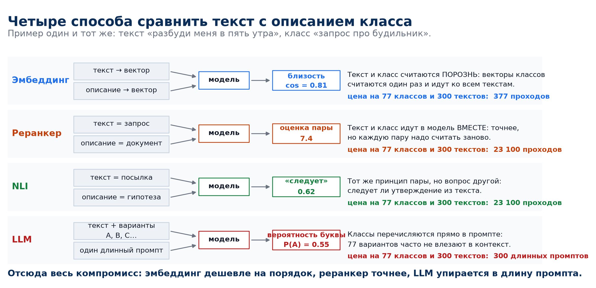
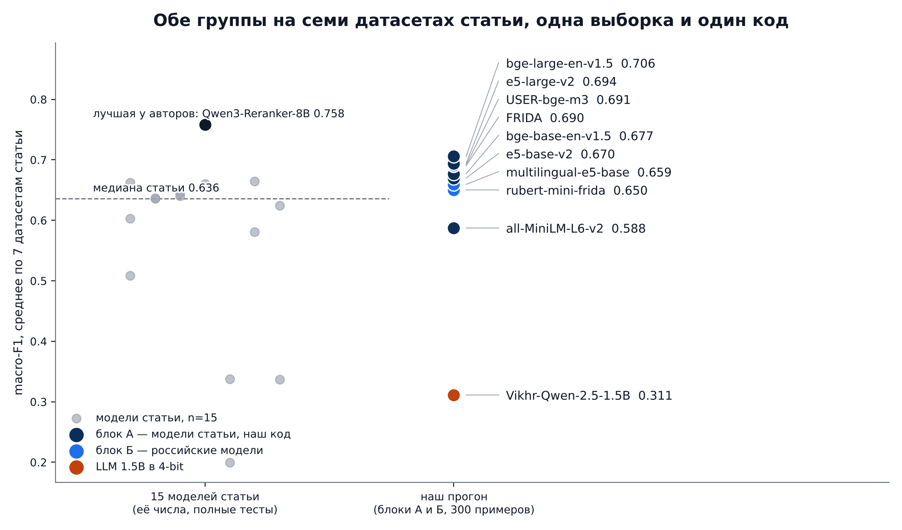
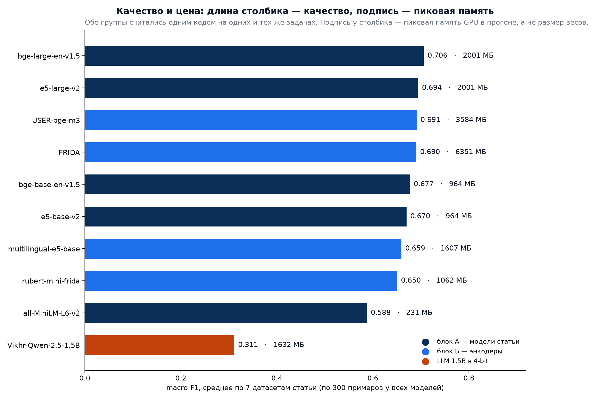
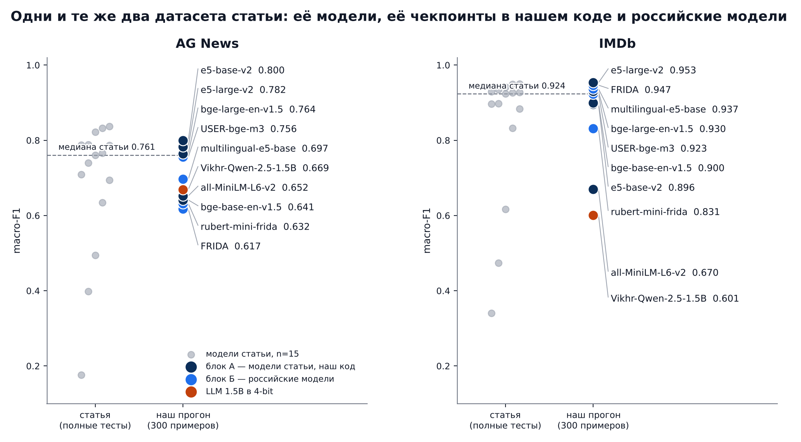
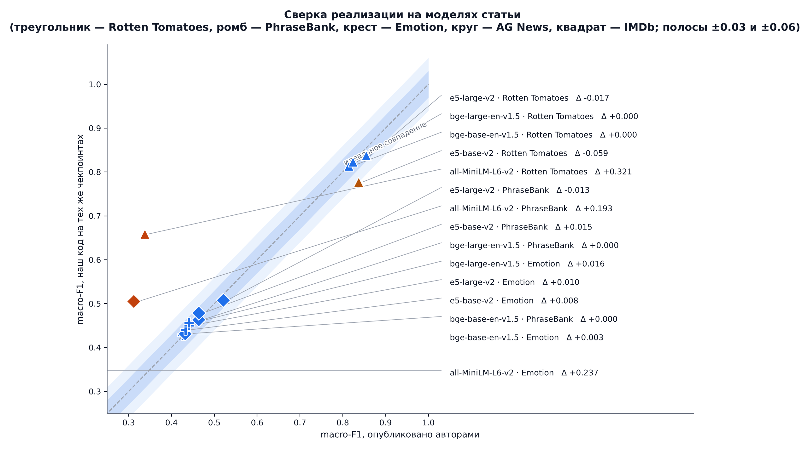
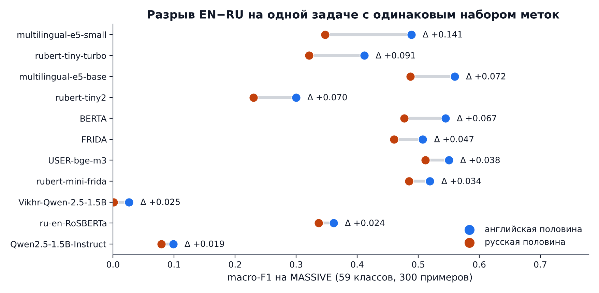
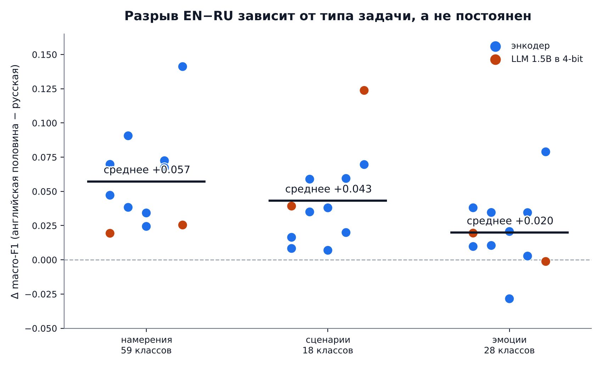
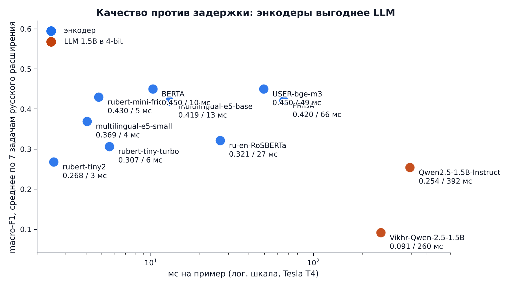

# BTZSC-RU — задание 2: анализ статьи и собственный эксперимент

Разбор статьи **BTZSC: A Benchmark for Zero-Shot Text Classification Across Cross-Encoders,
Embedding Models, Rerankers and LLMs** (Ilias Aarab, arXiv:2603.11991, ICLR 2026) и перенос её
протокола на русский язык и компактные модели, помещающиеся в бесплатный Google Colab.

Числовой отчёт, таблицы и графики ниже собираются из сохранённых результатов. После импорта нового
архива `colab_outputs_<run_id>.zip` workflow обновляет этот раздел автоматически.

<!-- REPORT:START -->
<!-- REPORT:RUN_ID=run5 -->
## Результаты эксперимента

Источник: [`results/run5/results.csv`](results/run5/results.csv). Значения ниже пересчитаны из сохранённых результатов; графики строятся скриптом [`make_figures.py`](scripts/make_figures.py).

### Коротко

- Прогон `run5`: 162 пар модель × датасет; успешных 162. `baseline` — 15, `block_a` — 35, `block_b` — 35, `ru_extension` — 77.
- На общем наборе задач лучший результат блока А — `BAAI/bge-large-en-v1.5` (0.706 macro-F1), блока Б — `deepvk/USER-bge-m3` (0.691). Средние посчитаны отдельно по одинаковым задачам.
- В русском расширении лучший средний macro-F1 — 0.450 у `deepvk/USER-bge-m3` на 7 задачах.
- Сверка с опубликованными числами: **11 пар из 15 совпали**; на границе — 1, расхождений — 3.

### Методика и сопоставимость

Блок А содержит модели статьи, блок Б — наши модели. Сравнение блоков допустимо на общих датасетах при одинаковом размере выборки. В таблицах ниже приведено невзвешенное среднее macro-F1 по задачам для каждой модели.
`baseline` использует полные тестовые сплиты для сверки с публикацией.
`ru_extension` — отдельный набор русских и парных языковых задач; его средние не смешиваются со средними блоков А и Б.

### Блоки А и Б: одна шкала

| Блок | Модель | ср. macro-F1 | ср. accuracy | задач | примеров на задачу |
|---|---|---:|---:|---:|---:|
| block_a | `BAAI/bge-large-en-v1.5` | 0.706 | 0.727 | 7 | 300 |
| block_a | `intfloat/e5-large-v2` | 0.694 | 0.714 | 7 | 300 |
| block_a | `BAAI/bge-base-en-v1.5` | 0.677 | 0.705 | 7 | 300 |
| block_a | `intfloat/e5-base-v2` | 0.670 | 0.693 | 7 | 300 |
| block_a | `sentence-transformers/all-MiniLM-L6-v2` | 0.588 | 0.608 | 7 | 300 |
| block_b | `deepvk/USER-bge-m3` | 0.691 | 0.714 | 7 | 300 |
| block_b | `ai-forever/FRIDA` | 0.690 | 0.713 | 7 | 300 |
| block_b | `intfloat/multilingual-e5-base` | 0.659 | 0.685 | 7 | 300 |
| block_b | `sergeyzh/rubert-mini-frida` | 0.650 | 0.670 | 7 | 300 |
| block_b | `Vikhrmodels/Vikhr-Qwen-2.5-1.5B-Instruct` | 0.311 | 0.380 | 7 | 300 |

Источник: строки `block_a` и `block_b` в CSV прогона.

### Русское расширение

| Модель | ср. macro-F1 | ср. accuracy | задач | примеров на задачу |
|---|---:|---:|---:|---:|
| `deepvk/USER-bge-m3` | 0.450 | 0.500 | 7 | 300 |
| `sergeyzh/BERTA` | 0.450 | 0.501 | 7 | 300 |
| `sergeyzh/rubert-mini-frida` | 0.430 | 0.482 | 7 | 300 |
| `ai-forever/FRIDA` | 0.420 | 0.475 | 7 | 300 |
| `intfloat/multilingual-e5-base` | 0.419 | 0.469 | 7 | 300 |
| `intfloat/multilingual-e5-small` | 0.369 | 0.411 | 7 | 300 |
| `ai-forever/ru-en-RoSBERTa` | 0.321 | 0.371 | 7 | 300 |
| `sergeyzh/rubert-tiny-turbo` | 0.307 | 0.350 | 7 | 300 |
| `cointegrated/rubert-tiny2` | 0.268 | 0.315 | 7 | 300 |
| `Qwen/Qwen2.5-1.5B-Instruct` | 0.254 | 0.288 | 7 | 300 |
| `Vikhrmodels/Vikhr-Qwen-2.5-1.5B-Instruct` | 0.091 | 0.122 | 7 | 300 |

Источник: строки `ru_extension` в CSV прогона.

### Сверка на моделях статьи

Источник: [`results/run5/replication_check.csv`](results/run5/replication_check.csv) и [опубликованные JSON](paper_scores/). Δ = наш macro-F1 минус значение статьи.

| Модель | Датасет | Статья | Наш код | Δ | Вердикт |
|---|---|---:|---:|---:|---|
| `sentence-transformers/all-MiniLM-L6-v2` | `btzsc_rottentomatoes` | 0.338 | 0.659 | +0.321 | расхождение |
| `sentence-transformers/all-MiniLM-L6-v2` | `btzsc_emotiondair` | 0.111 | 0.348 | +0.237 | расхождение |
| `sentence-transformers/all-MiniLM-L6-v2` | `btzsc_financialphrasebank` | 0.312 | 0.505 | +0.193 | расхождение |
| `intfloat/e5-base-v2` | `btzsc_rottentomatoes` | 0.837 | 0.777 | -0.059 | на границе |
| `intfloat/e5-large-v2` | `btzsc_rottentomatoes` | 0.855 | 0.838 | -0.017 | совпало |
| `BAAI/bge-large-en-v1.5` | `btzsc_emotiondair` | 0.440 | 0.456 | +0.016 | совпало |
| `intfloat/e5-base-v2` | `btzsc_financialphrasebank` | 0.463 | 0.478 | +0.015 | совпало |
| `intfloat/e5-large-v2` | `btzsc_financialphrasebank` | 0.521 | 0.508 | -0.013 | совпало |
| `intfloat/e5-large-v2` | `btzsc_emotiondair` | 0.441 | 0.451 | +0.010 | совпало |
| `intfloat/e5-base-v2` | `btzsc_emotiondair` | 0.432 | 0.440 | +0.008 | совпало |
| `BAAI/bge-base-en-v1.5` | `btzsc_emotiondair` | 0.426 | 0.429 | +0.003 | совпало |
| `BAAI/bge-base-en-v1.5` | `btzsc_rottentomatoes` | 0.814 | 0.814 | +0.000 | совпало |
| `BAAI/bge-base-en-v1.5` | `btzsc_financialphrasebank` | 0.431 | 0.431 | -0.000 | совпало |
| `BAAI/bge-large-en-v1.5` | `btzsc_rottentomatoes` | 0.823 | 0.823 | +0.000 | совпало |
| `BAAI/bge-large-en-v1.5` | `btzsc_financialphrasebank` | 0.463 | 0.463 | -0.000 | совпало |

### Графики

#### Семейства моделей



Схема способов классификации и их вычислительной цены. Схема по коду и списку моделей.

#### Обе группы на общей шкале



Блоки А и Б измерены на общей выборке; значения статьи показаны как внешний ориентир. Источник — прогон `run5` и опубликованные результаты статьи.

#### Качество и пиковая память



Средний macro-F1 по общим задачам; подписи показывают пиковую память. Источник — прогон `run5`.

#### Числа статьи и нашего кода



Датасеты совпадают, но размер выборки в публикации и нашем основном прогоне различается. Источник — прогон `run5` и опубликованные результаты статьи.

#### Сверка с опубликованными числами



Разница macro-F1 для моделей статьи на полном тестовом сплите. Источник — прогон `run5` и опубликованные результаты статьи.

#### Английский и русский MASSIVE



Парное сравнение качества на двух языках. Источник — прогон `run5`.

#### Разница по типам задач



Языковой разрыв зависит от набора меток и типа задачи. Источник — прогон `run5`.

#### Качество и задержка



Сопоставление macro-F1 со временем обработки примера. Источник — прогон `run5`.

### Источники и воспроизведение

- Исходная статья: [BTZSC, arXiv:2603.11991](https://arxiv.org/abs/2603.11991).
- Публикация авторских метрик: [`paper_scores/`](paper_scores/).
- Артефакты нашего прогона: [`results/run5/`](results/run5/).
- Метод загрузки и запуска: [инструкция Colab](docs/colab.md).

<!-- REPORT:END -->

## Порядок чтения

1. **[Результаты эксперимента](#результаты-эксперимента)** — методика, таблицы, графики и сверка со статьёй на этой странице.
2. **[Инструкция по Colab](docs/colab.md)** — запуск нового прогона и выгрузка ZIP.
3. **[Заметки по статье и коду](docs/)** — детали протокола и аудит моделей.

### Что лежит в git, а что нет

В репозитории хранятся сводные артефакты прогона: `results.csv`, `summary.csv`,
`run_config.json`, `environment.json`, `manifest_info.json`, `errors.log` — их хватает для всех
таблиц отчёта. Тяжёлые `predictions.jsonl` и `sample_manifest.csv` (десятки мегабайт, полностью
меняются после каждого прогона) обычно не версионируются. Архив `incoming/*.zip`
коммитится для запуска workflow импорта; после обработки исходный ZIP можно удалить отдельным коммитом.

`contracts.json` — проверенные контракты моделей и датасетов (revision, pooling, префиксы,
колонки, splits); из него берут значения `btzsc_ru/config.py` и тесты соответствия.

## Файлы отчёта

| Файл | О чём |
|---|---|
| [README.md](README.md) | полный отчёт с методикой, таблицами, выводами и графиками |
| [`figures/`](figures/) | PNG-графики, которые встроены в отчёт выше |
| [`results/`](results/) | исходные CSV и другие артефакты прогонов |
| [`paper_scores/`](paper_scores/) | опубликованные значения авторов статьи |

## Как устроен репозиторий

```
experiment.py              тонкий CLI: режимы all | preflight | smoke | evaluate | replicate | finetune | export
btzsc_ru/                  пакет эксперимента
  config.py                модели, датасеты, режимы, RunConfig; блок PAPER_MODELS для сверки
  data.py                  загрузка датасетов и вербализация меток
  reconstruction.py        восстановление multiclass-примеров из пар BTZSC
  sampling.py              единый sample_manifest.csv (seed 42)
  adapters.py              энкодеры (pooling/prefix → cosine) и LLM (multiple-choice по первому токену)
  metrics.py               macro-F1, accuracy, macro-P/R, покрытие классов, delta EN−RU
  io_utils.py              results.csv, predictions.jsonl, run_key, resume, бюджет времени, VRAM
  runner.py                оркестрация этапов, сверка на моделях статьи, экспорт архива
  finetune.py              дообучение rubert-tiny2 на MonoHime (пункт «8+»)
scripts/
  build_notebook.py        генерирует BTZSC_Colab.ipynb
  package_for_colab.py     собирает отдельный dist/colab_bundle.zip
  import_colab_outputs.py  импорт архива прогона: пересчёт метрик из predictions.jsonl
  make_figures.py          графики по артефактам прогона (PNG); руками графики не рисуются
  slide_figures.py         схемы-объяснялки для слайдов, тоже из кода и из чисел прогона
  check_replication.py     сверка наших чисел с опубликованными числами статьи
  build_reports.py         импорт → графики → сверка → README → презентация
BTZSC_Colab.ipynb          ноутбук для Colab; код проекта клонируется из репозитория
docs/colab.md            инструкция по запуску прогона
tests/                     проверки реконструкции, выборки, метрик, resume, импорта, ноутбука и отчёта
docs/                      заметки по статье и коду, аудит моделей и датасетов, речь к презентации
paper_scores/              опубликованные результаты авторов (13 JSON лидерборда)
data/                      локальная копия test-сплитов BTZSC (parquet)
results/<run_id>/          импортированные артефакты прогонов
incoming/                  сюда кладутся архивы colab_outputs_*.zip из Colab
```

## Рабочий цикл

1. **Прогон.** Открыть `BTZSC_Colab.ipynb` в Colab (T4), Runtime → Run all. Режим `all` сам проходит
   preflight → smoke → evaluate → replicate → finetune → export. Подробности — [`docs/colab.md`](docs/colab.md).
2. **Доставка результатов.** Скачанный `colab_outputs_<run_id>.zip` положить в `incoming/`, добавить в коммит и отправить в репозиторий.
3. **Сборка отчёта.** Workflow [`import-results`](.github/workflows/import-results.yml)
   проверяет архив, раскладывает данные в `results/<run_id>/`, пересчитывает метрики,
   строит графики и обновляет этот README.
   Вручную то же самое: `python scripts/build_reports.py`.
   Архив остаётся в `incoming/`, пока его не удалят отдельным коммитом.

## Проверки

```bash
python -m pytest -q tests                      # без сети и без моделей
python scripts/package_for_colab.py --check-embedded   # в ноутбуке нет встроенного архива
python scripts/build_btzsc_pptx.py                     # пересобрать презентацию
```

CI ([`check.yml`](.github/workflows/check.yml)) прогоняет то же самое плюс компиляцию ячеек ноутбука
и проверку на отсутствие токенов. Модели и датасеты в CI не скачиваются: успешный CI означает,
что код проверен, а не что эксперимент выполнен.

## Сверка кода на моделях статьи

Чтобы не полагаться на слово «протокол совпадает», в конфиге есть блок `PAPER_MODELS`: пять
чекпоинтов из самой статьи (all-MiniLM-L6-v2, e5-base-v2, e5-large-v2, bge-base-en-v1.5,
bge-large-en-v1.5). Режим `replicate` прогоняет их нашим кодом на `agnews` и `imdb` на полном тесте,
а `scripts/check_replication.py` сравнивает результат с опубликованными macro-F1
(`btzsc_ru.config.PAPER_REFERENCE`, источник — `results.by_dataset` лидерборда официального
репозитория). Итог попадает в раздел «Сверка на моделях статьи» выше.

Текущие числа сверки и расхождения с публикацией приведены в таблице выше.
Для разбора доступен переключатель кода кодирования:
`--encoder-backend st` считает энкодеры через `SentenceTransformer`, как в статье,
`--encoder-backend hf` (по умолчанию) — нашей реализацией.
